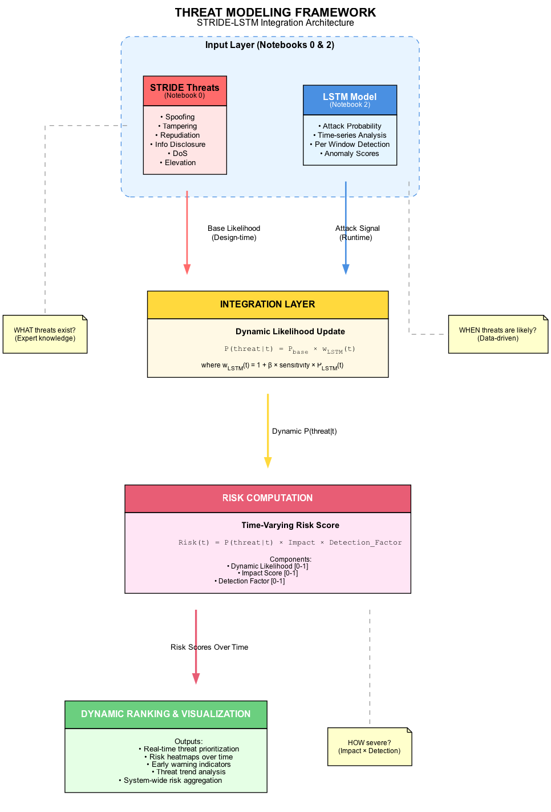
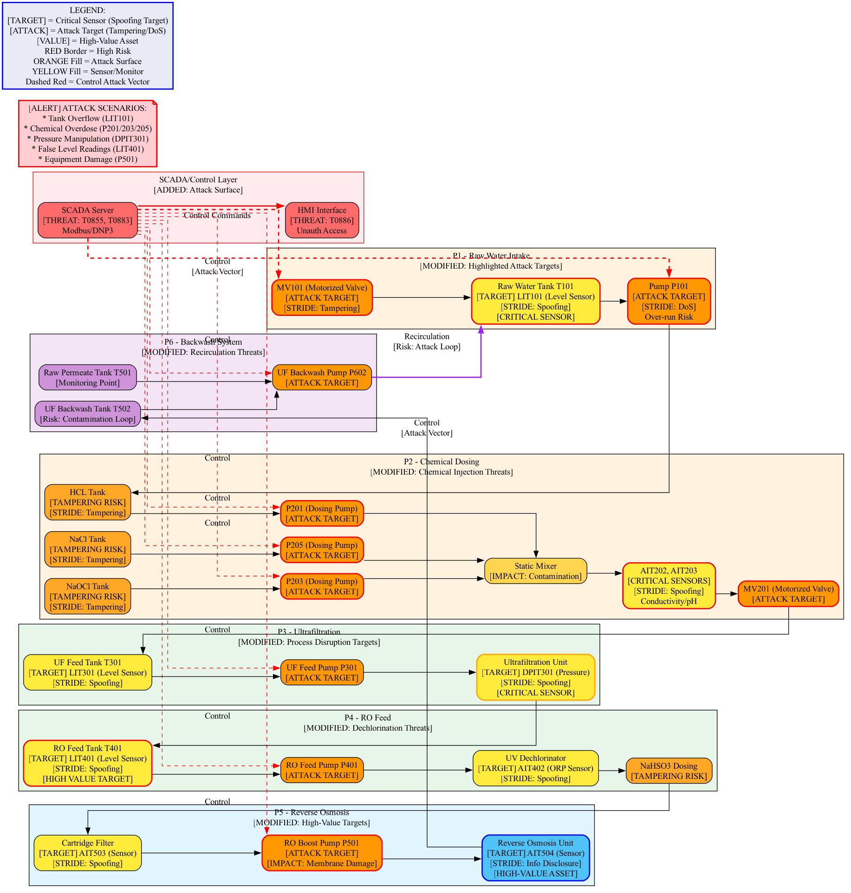

# AI-Driven Threat Modeling for Resilient Cyber-Physical Systems


An end-to-end research project on AI-driven threat modeling for resilient cyber-physical systems (CPS), combining structured threat analysis, adversarial learning, dynamic risk scoring, comparative evaluation, and explainable security intelligence for industrial control environments.

This work was developed in the context of `Cyber Security using Threat Modeling and Attack Simulation (CTMAS)` and focuses on the Secure Water Treatment (`SWaT`) CPS environment as the primary case study.

## Overview

This repository presents a hybrid security workflow that connects:

- design-time CPS threat modeling using `STRIDE`, attack trees, and attack graphs
- data-centric preprocessing of the `SWaT` dataset for temporal attack detection
- `LSTM`-based adversarial learning for anomaly and attack identification
- integrated `STRIDE + LSTM` dynamic risk analysis
- comparative evaluation against `standalone LSTM` and `LSTM + PASTA`
- contextual explainability through `MITRE ATT&CK for ICS` and ontology-driven threat knowledge

The project is organized as a notebook-driven research pipeline, where each notebook corresponds to a clear stage in the overall methodology and collectively forms a coherent experimental flow.

## Visual Snapshot

<p align="center">
  
  
</p>

## Research Workflow

The project is intentionally structured in the same sequence as the technical workflow:

1. `00_CPS_and_Threat_Modeling.ipynb`
   Builds the SWaT system context, asset inventory, STRIDE threat model, baseline risk view, and attack-tree representation.

2. `01_Data_Preprocessing_SWaT.ipynb`
   Cleans, transforms, normalizes, and windows the SWaT dataset for temporal learning and downstream modeling.

3. `02_LSTM_Adversarial_Learning.ipynb`
   Trains and evaluates the stacked LSTM-based adversarial detector for attack classification.

4. `03_STRIDE_LSTM_Integration_and_Risk.ipynb`
   Integrates learned attack likelihoods with structured STRIDE-based risk reasoning to produce dynamic risk analysis.

5. `04_Comparative_Evaluation_and_Resilience.ipynb`
   Compares `STRIDE-only`, `LSTM + PASTA`, and `LSTM + STRIDE` configurations through performance, risk, and resilience perspectives.

6. `05_MITRE_and_Ontology_Context.ipynb`
   Extends the framework with MITRE ATT&CK for ICS mapping, ontology-backed threat context, and analyst-facing explainability.

## Key Reported Results

### Data and Modeling Snapshot

| Item | Value |
|---|---:|
| Processed SWaT samples | 946,728 |
| Selected modeling features | 51 |
| Temporal window size | 30 |
| Total windows generated | 946,699 |
| Train windows | 662,689 |
| Test windows | 284,010 |

### LSTM Detector Performance

| Metric | Reported Value |
|---|---:|
| Accuracy | 99.57% |
| Precision | 93.34% |
| Recall | 99.65% |
| F1-Score | 96.39% |
| ROC AUC | 0.9999 |
| PR AUC | 0.9985 |
| Optimal Threshold | 0.88 |
| Best Threshold F1 | 98.06% |

### Comparative Analysis

| Framework | Accuracy | F1-Score | ROC AUC | Early Detection | Resilience Score |
|---|---:|---:|---:|---:|---:|
| STRIDE-only | 0.942 | 0.000 | 0.500 | 0.0 steps | 0.000 |
| LSTM + PASTA | 0.996 | 0.964 | 1.000 | 16.9 steps | 0.794 |
| LSTM + STRIDE | 0.996 | 0.964 | 1.000 | 16.9 steps | 0.992 |

### Dynamic Risk Summary

| Risk Measure | Value |
|---|---:|
| Static baseline total risk | 6.574 |
| Mean dynamic system risk | 7.149 |
| Mean risk during normal periods | 7.107 |
| Mean risk during attack periods | 7.830 |
| Risk increase during attacks | 10.16% |

## Repository Structure

```text
.
├── 00_CPS_and_Threat_Modeling.ipynb
├── 01_Data_Preprocessing_SWaT.ipynb
├── 02_LSTM_Adversarial_Learning.ipynb
├── 03_STRIDE_LSTM_Integration_and_Risk.ipynb
├── 04_Comparative_Evaluation_and_Resilience.ipynb
├── 05_MITRE_and_Ontology_Context.ipynb
├── Attack Graph/
├── Attack Tree/
├── UML DIAGRAMS/
├── Threat_Modeling_Framework.png
├── SWaT_CPS_Infrastructure_and_Threat_Map.png
├── swat_original_diagram.jpeg
├── PROJECT_DESCRIPTION.md
├── README.md
└── report/
    └── project_report.pdf
```

## Final Report

The polished project report is available here:

- [Project Report PDF](report/project_report.pdf)

## Important Repository Note

To keep the GitHub repository clean, lightweight, and shareable, the following directories are intentionally excluded from version control:

- `ignore/`
- `pre_processed_data/`
- `project_v0/`
- `SWAT_dataset/`
- `.vscode/`
- all files inside `report/` except `project_report.pdf`

This means the repository primarily contains the notebook pipeline, design artifacts, diagrams, and final PDF report. The heavy intermediate datasets, generated arrays, trained model files, and local report source/build files remain outside the published repository.

## Project Significance

The contribution of this project lies in unifying traditionally separate security tasks into one research pipeline:

- formal threat modeling for CPS environments
- data-driven attack detection using sequence learning
- dynamic security risk reasoning informed by model outputs
- comparative analysis across reasoning frameworks
- explainable, context-rich security interpretation using MITRE ATT&CK for ICS and ontology mapping

This makes the repository valuable both as an academic project and as a structured prototype for AI-assisted cyber-defense in industrial control systems.

## Academic Context

- **Course:** Cyber Security using Threat Modeling and Attack Simulation (`CTMAS`)
- **Department:** Computer Science and Engineering
- **Institute:** The LNM Institute of Information Technology (`LNMIIT`), Jaipur, India
- **Course Instructor:** Dr. Ashish Kumar Diwedi

## Authors

- Lokik Ganeriwal
- Hemang Bansal

## Contact

- Email: `23ucs634@gmail.com`
- Repository: `https://github.com/lokikg/AI-Driven-Threat-Modeling-for-Resilient-Cyber-Physical-Systems.git`

